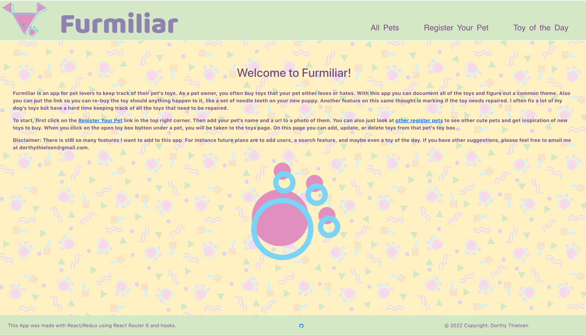

<h2>Furmiliar</h2>
Furmiliar is a Rails backend and React/Redux frontend app that stores information about your pet's favorite toys. This is my final project for Flatiron Bootcamp. 

Each pet has their own virtual toy box where you can input all the toys your pet has in case you want to purchase it again or if you want to know which toys need repaired. Each toy can contain the following information: name, brand, price, url of where it was purchased, and any features it has like squeakers.  

<h3>Installing Furmiliar:</h3>
To install Furmiliar, follow these steps:
First you will need to clone the backend here: https://github.com/dotnotation/Furmiliar_React_Backend
Install all required gems in the Gemfile by running `bundle install`. Create your database by running `rails db:migrate`. (Optional) Seed your database with the default dummy data by running `rails db:seed`. Run `rails s` in the terminal to run the ApplicationController. Open the port in the browser (rails defaults to port 3000) if you want to see the data in the api. For all pet information visit http://localhost:3000/pets. For all toy information visit http://localhost:3000/toys. To exit the server run `ctrl + c` in the terminal. You will need to clone the frontend next: https://github.com/dotnotation/Furmiliar_React_Frontend. Run `npm install` or `yarn install` to add all dependencies. To start up the server use `yarn start` or `npm start`. 

<h3>Using Furmiliar:</h3>
You can view all pets or register your own pet. Then you can select your pet and add toys to their toy box. There is full CRUD functionality with this app. Currently, their is no user aspect to this app which means you can CRUD other people's pets. The plan is to add users later. 

<h3>Contributors:</h3>
This project was created by @dotnotation as a student of Flatiron School Software Engineering.

<h3>Contact:</h3>
If you want to contact me you can email me at dorthythielsen@gmail.com. 

<h3>License:</h3>
This project uses the following license: MIT License.